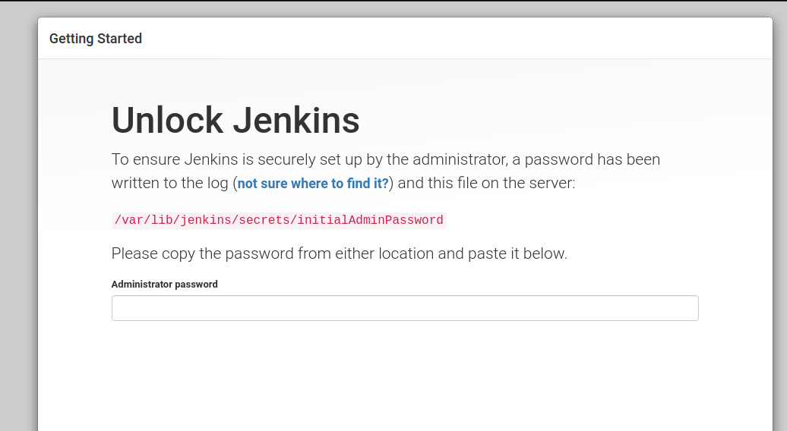
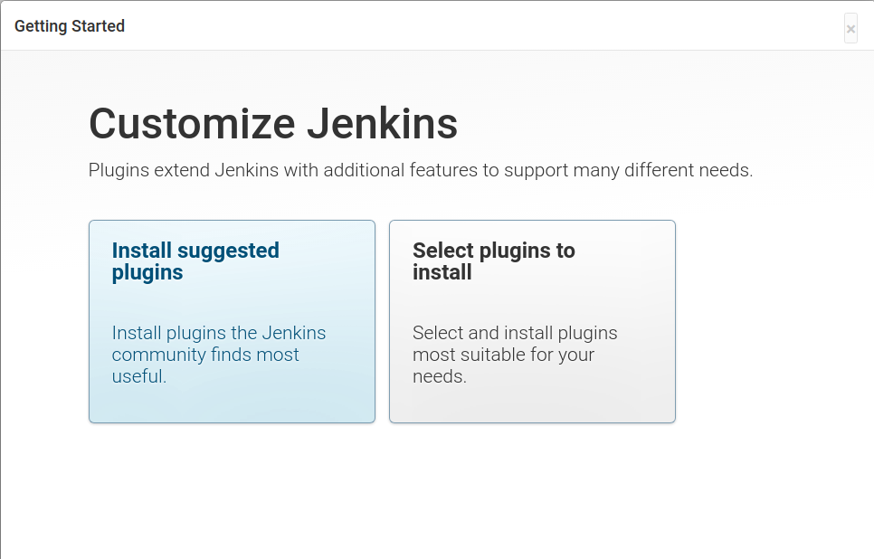
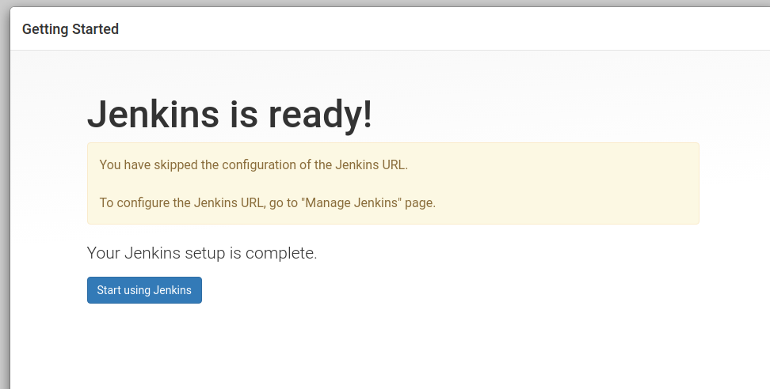

# Install on linux

instructions on https://pkg.jenkins.io/debian-stable/ didn't work

`sudo apt-get install fontconfig openjdk-11-jre`

`sudo wget -q -O - https://pkg.jenkins.io/debian-stable/jenkins.io.key | sudo apt-key add -`

`sudo sh -c 'echo deb https://pkg.jenkins.io/debian-stable binary/ > /etc/apt/sources.list.d/jenkins.list' `

`sudo apt update`

`sudo apt-get install jenkins`

jenkins is already running as a service at this point. You can check the status of the service with `sudo systemctl status jenkins`

you can access Jenkins service from a browser with `127.0.0.1:8080`

With the link in the above screenshot, you can use the cat command to view the initial password:

`sudo cat /var/lib/jenkins/secrets/initialAdminPassword`

After you enter the password, you want to install the suggested plugins

You'll be asked to generate a username and password. This is important if this is a computer that others can connect to from your network because jenkins is listening on all ports.

You'll be asked if you want to change the url. You can choose to skip this step if you want. For example, if you're just testing 
