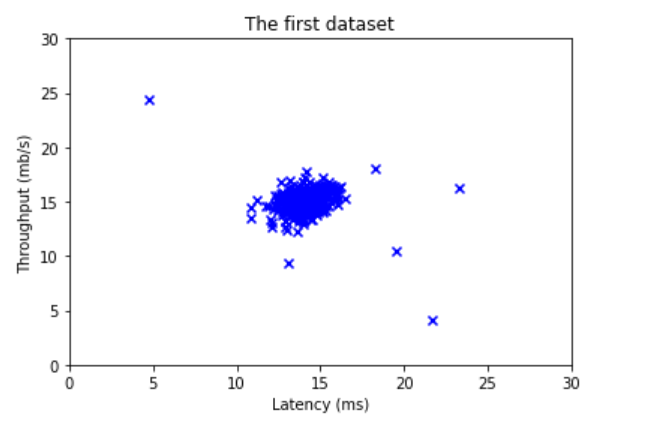
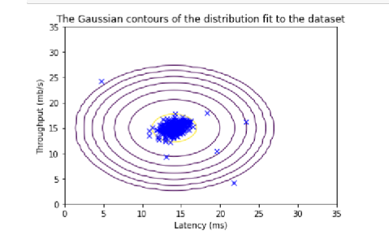

This is part of a series of blog posts about my findings when creating my new BotPals project using React. In this post, I wanted to share how I started using typescript interfaces in my project in an attempt to write cleaner code.

I started this project out by using Vite, a choice that I'll discuss in a later post. During the setup process with Vite, I was asked whether I wanted to use javascript or typescript, I chose to use typescript because of the notoriously better development experience and adding type annotations. However, in order to have my editor actually warn me of error, I had to enable to do two more things.


1. I needed create a tsconfig.json file to add a compiler option.

Rather than manually create this file at the root of your project, I wanted to use the CLI to generate this which meant that I had to install this tool on my linux install with `sudo apt-get install node-typescript`.

Once the package was installed, I was able to use `tsc --init` to generate a `tsconfig.json` file.

2. In that `tsconfig.json` file, I needed to make sure that it was using the correct compiler option. If you check in the file for `compilerOptions`, you'll see that `jsx` is commented out. At least, that is true in the version that I was using, 4.5.4, and `jsx` is also set to a different value at first.

```json
{
  "compilerOptions": {
    "jsx": "react-jsx"
  }
}
```

This will give you those lovely squiggles in your file in vscode to inform you that you must begin specifying types. You'll also no longer need to import react on every component. VSCode also told me this as the `import React` statement was grayed out as it's never used.



Now get ready to see the red squiggles appear!



To fix this and give pages a type, we can create an interface which tells the mapping array what an object `Page` is supposed to look like

`src/components/pages/PagesNav.tsx`
```ts
interface Page {
  id: number;
  title: string;
  pageLink: string;
}
const PagesNav = () => {
  return (
    <div className="flex space-x-2">
        {pages.map((page:Page) => (
              <PageNav key={page.id} title={page.title} pageLink={page.pageLink}/>
            ))}
      </div>
  )
}

export default PagesNav
```

Enabling typescript saves a lot of heartache for other developers (and future you) for seeing exactly what your object requires. 

Rather than defining interface in the above, I like to create a seperate interfaces folder in my project and append Interface to the filename so that I can keep track of what's an interface and what's a component. 

`src/interfaces/PageInterface.ts`
```ts
export interface PageInterface {
    id: number;
    title: string;
    pageLink: string;
  }
```

`src/components/pages/PagesNav.tsx`
```tsx
import pages from '../../data/pages.json'
import PageNav from './PageNav'
import { PageInterface } from '../../interfaces/PageInterface'

const PagesNav = () => {
  return (
    <div className="flex space-x-2">
        {pages.map((page:PageInterface) => (
              <PageNav id={page.id} title={page.title} pageLink={page.pageLink}/>
            ))}
      </div>
  )
}

export default PagesNav
```

The advantage with seperating this interface into a seperate file is that now I can just make reference on the PageNav component file without having to rewrite the interace.

`src/components/pages/PageNav.tsx`
```tsx
import { PageInterface } from '../../interfaces/PageInterface'

const PageNav = ({id, title, pageLink}:PageInterface) => {
  return (
    <a
        href={pageLink}
        className="text-white hover:bg-gray-900 hover:text-white rounded-md px-3 py-2"
    >{title}</a>
  )
}

export default PageNav

```

However, as your objects may begin to have more object properties as you scale you may want to just include a page property on the PageNav Component

`src/components/pages/PagesNav.tsx`
```tsx
<div className="flex space-x-2">
        {pages.map((page:PageInterface) => (
              <PageNav key={page.id} page={page}/>
            ))}
      </div>
```

It's certainly more scalable this way as you try to add more properties, however this now becomes an issue with the interface because you can't just use `PageInterface` anymore.

`src/components/pages/PageNav.tsx`
```tsx
import { PageInterface } from '../../interfaces/PageInterface'

interface PageNavProps {
  page: PageInterface;
}

const PageNav = ({page}:PageInterface) => {
  return (
    <a
        href={page.pageLink}
        className="text-white hover:bg-gray-900 hover:text-white rounded-md px-3 py-2"
    >{page.title}</a>
  )
}

export default PageNav
```

This is because you now only have `page` in the array destruring so typescript is unable to properly validate. What you can do is to create a new interface on `PageNav.tsx` and use React Functional Components to validate the type of the component.

```tsx
import { PageInterface } from '../../interfaces/PageInterface';

interface PageNavProps {
  page: PageInterface;
}

const PageNav: React.FC<PageNavProps> = ({ page }) => {
  return (
    <a
        href={page.pageLink}
        className="text-white hover:bg-gray-900 hover:text-white rounded-md px-3 py-2"
    >{page.title}</a>
  );
}

export default PageNav;
```


Even just using this small interface aspect of typescript will enable a much smoother development experience and promote cleaner and more maintainable code. 