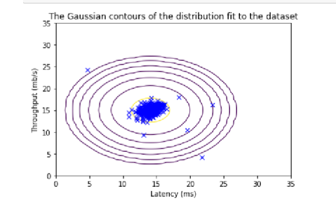

In order to work with the Guassian below to create the anomaly detection algorithm, we'll define the following helper functions. You'll also need to download the following data files with all of the examples

[X_train](https://githubusercontent.com/bjellesma/BillJellesmaCoding/master/static/X_part1.npy) - This data will be used to fit a Guassian distribution
[X_val](https://githubusercontent.com/bjellesma/BillJellesmaCoding/master/static/X_part1.npy) and [y_val](https://githubusercontent.com/bjellesma/BillJellesmaCoding/master/static/X_part1.npy) are cross validation sets that will be used to select a threshold to determine anomalous data

```py
import numpy as np
import matplotlib.pyplot as plt
from utils import *

%matplotlib inline

def load_data():
    X = np.load("X_part1.npy")
    X_val = np.load("data/X_val_part1.npy")
    y_val = np.load("data/y_val_part1.npy")
    return X, X_val, y_val

def multivariate_gaussian(X, mu, var):
    """
    Computes the probability 
    density function of the examples X under the multivariate gaussian 
    distribution with parameters mu and var. If var is a matrix, it is
    treated as the covariance matrix. If var is a vector, it is treated
    as the var values of the variances in each dimension (a diagonal
    covariance matrix
    """
    
    k = len(mu)
    
    if var.ndim == 1:
        var = np.diag(var)
        
    X = X - mu
    p = (2* np.pi)**(-k/2) * np.linalg.det(var)**(-0.5) * \
        np.exp(-0.5 * np.sum(np.matmul(X, np.linalg.pinv(var)) * X, axis=1))
    
    return p

def visualize_fit(X, mu, var):
    """
    This visualization shows you the 
    probability density function of the Gaussian distribution. Each example
    has a location (x1, x2) that depends on its feature values.
    """
    
    X1, X2 = np.meshgrid(np.arange(0, 35.5, 0.5), np.arange(0, 35.5, 0.5))
    Z = multivariate_gaussian(np.stack([X1.ravel(), X2.ravel()], axis=1), mu, var)
    Z = Z.reshape(X1.shape)

    plt.plot(X[:, 0], X[:, 1], 'bx')

    if np.sum(np.isinf(Z)) == 0:
        plt.contour(X1, X2, Z, levels=10**(np.arange(-20., 1, 3)), linewidths=1)
        
    # Set the title
    plt.title("The Gaussian contours of the distribution fit to the dataset")
    # Set the y-axis label
    plt.ylabel('Throughput (mb/s)')
    # Set the x-axis label
    plt.xlabel('Latency (ms)')
```

Firstly, let's just load the dataset and visualize where it falls on a scatter plot.

```py
plt.scatter(X_train[:, 0], X_train[:, 1], marker='x', c='b') 

# Set the title
plt.title("The first dataset")
# Set the y-axis label
plt.ylabel('Throughput (mb/s)')
# Set the x-axis label
plt.xlabel('Latency (ms)')
# Set axis range
plt.axis([0, 30, 0, 30])
plt.show()
```


To calculate the guassian, we can use the following for any 2d numpy array

```py
def estimate_gaussian(X): 
    """
    Calculates mean and variance of all features 
    in the dataset
    
    Args:
        X (ndarray): (m, n) Data matrix
    
    Returns:
        mu (ndarray): (n,) Mean of all features
        var (ndarray): (n,) Variance of all features
    """

    m, n = X.shape
    
    ### START CODE HERE ### 
    mu = []
    var = []
    for i in range(0, n):
        sum = 0
        dif = 0
        for j in range(0, m):
            sum += X[j][i]
        mu.append((1/m) * sum)
        for j in range(0, m):
            dif += (X[j][i] - mu[i]) ** 2
        var.append((1/m) * dif)
    print(mu)
    mu = np.array(mu)
    var = np.array(var)
    ### END CODE HERE ### 
        
    return mu, var
```

Or we can use numpy's built in functions to take advantage of numpy's vector operations to act on an entire array at once

```py
def estimate_gaussian(X):
    """
    Calculates mean and variance of all features 
    in the dataset using NumPy vectorized operations
    
    Args:
        X (ndarray): (m, n) Data matrix
    
    Returns:
        mu (ndarray): (n,) Mean of all features
        var (ndarray): (n,) Variance of all features
    """
    # Calculate mean and variance along the feature axis (axis=0)
    mu = np.mean(X, axis=0)
    var = np.var(X, axis=0, ddof=0)  # ddof=0 for population variance
    
    return mu, var
```

Now, we can use the following to view a contour plot of the Guassian

```py
p = multivariate_gaussian(X_train, mu, var)

#Plotting code 
visualize_fit(X_train, mu, var)
```



## Selecting epsilon

Now we can create a function to select the best value of epsilon, our threshold that we'll use to determine if the next value is an anomaly. Notice that since `y_val` and `p_val` are both ndarray type, we can take advantage of `np.sum` to quickly calculate a new array without having to use loops.

```py
def select_threshold(y_val, p_val): 
    """
    Finds the best threshold to use for selecting outliers 
    based on the results from a validation set (p_val) 
    and the ground truth (y_val)
    
    Args:
        y_val (ndarray): Ground truth on validation set
        p_val (ndarray): Results on validation set
        
    Returns:
        epsilon (float): Threshold chosen 
        F1 (float):      F1 score by choosing epsilon as threshold
    """ 

    best_epsilon = 0
    best_F1 = 0
    F1 = 0
    
    step_size = (max(p_val) - min(p_val)) / 1000
    
    for epsilon in np.arange(min(p_val), max(p_val), step_size):
    
        ### START CODE HERE ### 
        
        predictions = p_val < epsilon
        
#         np.sum will loop through the arrays provided they are the same size
        tp = np.sum((predictions == 1) & (y_val == 1))
        fp = np.sum((predictions == 1) & (y_val == 0))
        fn = np.sum((predictions == 0) & (y_val == 1))
        
#         precision and recall and F1
        prec = tp/(tp+fp)
        rec = tp/(tp+fn)
        F1 = (2*prec*rec)/(prec+rec)
        
        
        
        
        ### END CODE HERE ### 
        
        if F1 > best_F1:
            best_F1 = F1
            best_epsilon = epsilon
        
    return best_epsilon, best_F1
```

Now we can use epsilon to discover the outliers in our data set

```py
p_val = multivariate_gaussian(X_val, mu, var)
epsilon, F1 = select_threshold(y_val, p_val)

# Find the outliers in the training set 
outliers = p < epsilon

# Visualize the fit
visualize_fit(X_train, mu, var)

# Draw a red circle around those outliers
plt.plot(X_train[outliers, 0], X_train[outliers, 1], 'ro',
         markersize= 10,markerfacecolor='none', markeredgewidth=2)
```